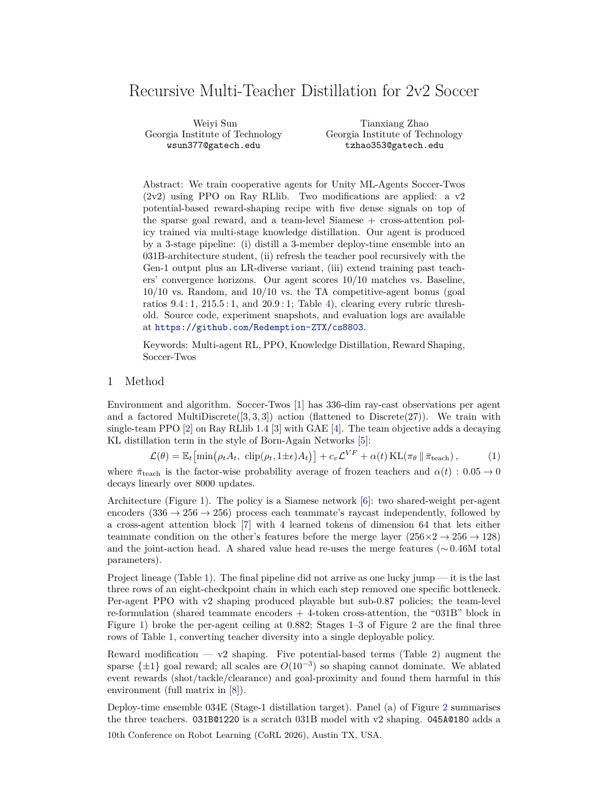

<div align="center">

# CS8803 DRL — Soccer-Twos

**[English](README.md)** &nbsp;·&nbsp; [简体中文](README_zh.md)

CS8803 Deep Reinforcement Learning final project — a 2v2 soccer multi-agent
trained on top of the [soccer-twos starter kit](https://github.com/mdas64/soccer-twos-starter).


</div>

---

## 📄 Final Report

**[Recursive Multi-Teacher Distillation for 2v2 Soccer](report/main.pdf)** &nbsp;·&nbsp; Weiyi Sun, Tianxiang Zhao &nbsp;·&nbsp; CS8803 DRL · Spring 2026

<div align="center">
<a href="report/main.pdf">
  
</a>
</div>

### Headline result (autograder)

| Opponent | Matches won | Goals for / against | Goal ratio | Score |
|---|---:|---:|---:|---:|
| Random | **10 / 10** | 431 / 2 | 215.5 : 1 | 25 / 25 |
| Baseline (`ceia`) | **10 / 10** | 254 / 27 | 9.4 : 1 | 25 / 25 |
| TA competitive agent | **10 / 10** | 209 / 10 | 20.9 : 1 | 5 / 5 |
| | | | **Total** | **55 / 55** |

The submitted policy `055v2_extend@1750` is a single-forward-pass agent
produced by a 3-stage recursive distillation pipeline (Born-Again-Networks
style):

1. **Stage 1** — distill a 3-teacher deploy-time ensemble (`031B + 045A + 051A`) into a fresh student.
2. **Stage 2** — refresh the teacher pool with the Stage-1 student plus an LR-diverse variant; distill again.
3. **Stage 3** — extend training past the original iter-1250 horizon to iter 2000, selecting the lowest-variance checkpoint.

A 9000-episode audit on our own evaluator confirms `0.907 ± 0.004` WR vs. the
Baseline agent (CI `[0.899, 0.914]`).

Submission package: [`submission/CS8803DRL_AGENT/`](submission/CS8803DRL_AGENT/) &nbsp;·&nbsp; report build instructions: [`report/README.md`](report/README.md)

Full training-artifacts backup (≈64 GB, 3 tarballs containing all `ray_results`, failure-cases, imitation, and trajectories): [Google Drive](https://drive.google.com/drive/folders/1uZyD3raAh4NoFKLpTxhQDxuWFTwrzHJ4?usp=sharing)

---

## 🛠 Tech stack

| Layer | Pinned version | Notes |
|---|---|---|
| Python | **3.8** (strict) | Required by Ray RLlib 1.4 / ML-Agents 0.27 |
| PyTorch | 2.x | All training scripts default to PyTorch |
| Ray RLlib | **1.4.0** (strict) | Single-team PPO + multi-agent backends |
| Unity ML-Agents | 0.27.0 | Runs the Soccer-Twos binary headless |
| `protobuf` | **3.20.3** (strict) | Compatibility pin |
| `pydantic` | **1.10.13** (strict) | Compatibility pin |
| Compute | NVIDIA H100 (PACE) | All long runs go through SLURM |
| Report | Tectonic + HTML/SVG | LaTeX `main.pdf` + headless-Chrome figure rendering |

> Do **not** upgrade Python or Ray — both are upstream-pinned compatibility requirements.

---

## Quick start

```bash
# One-line install (recommended)
bash scripts/setup/setup.sh

# For manual installation, see the Setup section in CLAUDE.md.
```

```bash
# H100 / Hopper nodes: layer a GPU overlay on top of the existing soccertwos env
bash scripts/setup/setup_h100_overlay.sh
```

```bash
# Watch a random agent play
python examples/example_random_players.py

# Train
python -m cs8803drl.training.train_ray_base_team_vs_random
python -m cs8803drl.training.train_ray_base_team_vs_baseline
python -m cs8803drl.training.train_ray_base_ma_teams
python -m cs8803drl.training.train_ray_team_vs_random_shaping
python -m cs8803drl.training.train_bc_team_policy
python -m cs8803drl.training.train_ray_mappo_vs_baseline
python -m cs8803drl.training.train_ray_role_specialization
python -m cs8803drl.training.train_ray_shared_policy_role_token
python -m cs8803drl.training.train_ray_selfplay
python -m cs8803drl.training.train_ray_curriculum

# Evaluate
python -m soccer_twos.watch -m example_player_agent
python -m soccer_twos.watch -m cs8803drl.deployment.trained_team_ray_agent
python -m soccer_twos.watch -m cs8803drl.deployment.trained_ma_team_agent
python -m soccer_twos.watch -m cs8803drl.deployment.trained_bc_team_agent
python -m cs8803drl.evaluation.eval_rllib_checkpoint_vs_baseline -c <checkpoint_path>
python -m cs8803drl.evaluation.evaluate_matches -m1 <agent_module> -m2 ceia_baseline_agent
python scripts/eval/evaluate_official_suite.py --team0-module cs8803drl.deployment.trained_ray_agent --opponents baseline -n 200 --checkpoint <checkpoint_path>
```

## Project layout

```
├── CLAUDE.md                            AI-collaboration entry point (rules + architecture summary + protection levels)
├── CHANGELOG.md                         Version log
├── curriculum.yaml                      Curriculum-learning task config
├── requirements.txt                     Dependency spec
├── sitecustomize.py                     Python compatibility shim
│
├── cs8803drl/                           Main package
│   ├── core/                            Runtime core: env, checkpoint, reward / info
│   ├── training/                        Training entrypoints (all train_ray_* variants)
│   ├── deployment/                      Deploy-time agent wrappers
│   ├── evaluation/                      Local evaluation entrypoints
│   └── branches/                        Experiment helpers (role / lstm / summary / cc / …)
│
├── scripts/                             Structured script layer
│   ├── setup/                           Environment + GPU-overlay setup
│   ├── eval/                            Official evaluation, sweeps, backfills, legacy ckpt match-ups
│   ├── tools/                           Build / utility scripts
│   └── batch/                           SLURM / direct batch jobs
│       ├── starter/                     Starter-style entrypoints
│       ├── base/                        From-scratch base-model training
│       ├── adaptation/                  Downstream adaptation on top of a base ckpt
│       ├── experiments/                 Branch experiment scripts
│       └── …                            Other categories grouped by responsibility
│
├── agents/                              Submission-ready agent modules + templates
├── ceia_baseline_agent/                 Pre-trained baseline opponent
├── example_player_agent/                Upstream template: single-player agent
├── example_team_agent/                  Upstream template: team agent
├── examples/                            Upstream example scripts (archived for reference)
├── report/                              Final report — LaTeX source + figures + main.pdf
├── submission/                          Course submission package (CS8803DRL_AGENT.zip + unzipped dir)
└── docs/                                Project documentation
```

Notes:

- Runtime code has been consolidated into the `cs8803drl/` package; the project
  root keeps only meta-files, configs, and a few legacy compat shims.
- Directory-governance rules: see [docs/management/directory-governance.md](docs/management/directory-governance.md).
- Script-layer responsibilities: see [scripts/README.md](scripts/README.md).

## Documentation

Documentation index: [docs/README.md](docs/README.md).

| Document | Purpose |
|------|------|
| [CLAUDE.md](CLAUDE.md) | AI-collaboration entry: project architecture and constraints |
| [Architecture overview](docs/architecture/overview.md) | Upstream diff, directory structure, predecessor work |
| [Code audit](docs/architecture/code-audit-000.md) | Module-by-module analysis at hand-off, issues, improvement targets |
| [Engineering standards](docs/architecture/engineering-standards.md) | Setup, commit flow, experiment iteration, env-var reference |
| [Directory governance](docs/management/directory-governance.md) | Root-retention rules, archive rules, reorg boundaries |
| [Cleanup log](docs/management/cleanup-log.md) | Disk-cleanup history, removed content, quota deltas |
| [Phase plan](docs/plan/plan-002-il-mappo-dual-mainline.md) | Active mainline: IL / BC + baseline exploitation + MAPPO fair comparison |
| [Experiment log](docs/experiments/README.md) | Experiment index and snapshots |
| [Assignment spec](docs/references/Final%20Project%20Instructions%20Document.md) | Grading rubric (Markdown rendering) |

## Upstream

- Course-provided starter: https://github.com/mdas64/soccer-twos-starter
- Environment source: https://github.com/bryanoliveira/soccer-twos-env
- Original upstream README: [docs/references/upstream-README.md](docs/references/upstream-README.md)
